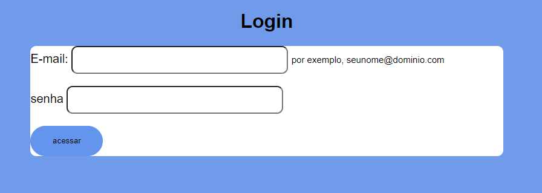

## Objetivo
O projeto tem como objetivo criar uma página de login utilizando HTML e CSS, precisando conter um campo para Email,   senha e o botão Acessar.

## HTML 
HTML foi reutilizado de outro projeto já pronto, e editado para cumprir o que era pedido na tarefa.

## Resultado 

